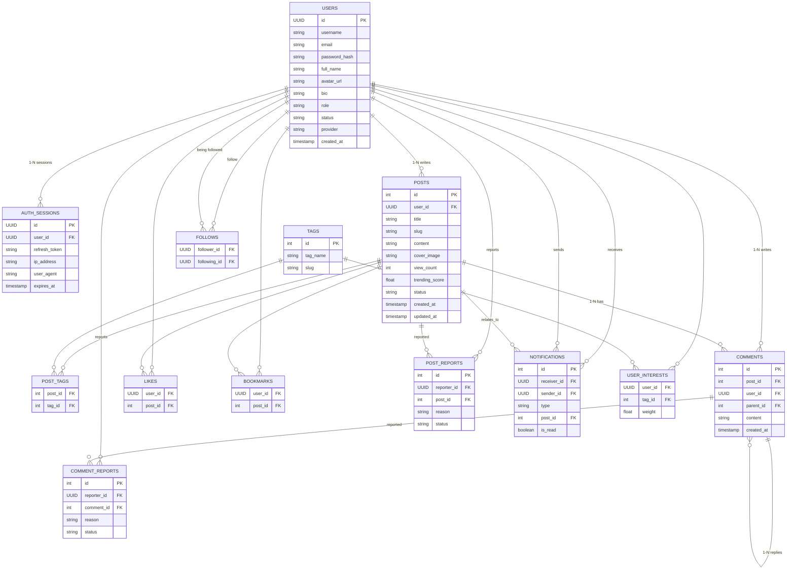

# **DATABASE** 

Hệ thống cơ sở dữ liệu cho Forum tích hợp các tính năng xác thực, tương tác mạng xã hội (và định hướng AI).

---
## Danh sách các Đối tượng (Objects/Entities)

| STT | Tên lớp (Object) | Mô tả chi tiết |
| :--- | :--- | :--- |
| 1 | **users** | Lưu trữ tài khoản, thông tin cá nhân, vai trò (Admin/Student) và trạng thái. |
| 2 | **auth_sessions** | Quản lý phiên đăng nhập, Token và bảo mật IP (Bảo vệ Route). |
| 3 | **posts** | Nội dung bài viết, tiêu đề, ảnh bìa và điểm xu hướng (Trending Score). |
| 4 | **tags** | Danh mục các chủ đề để phân loại và lọc bài viết. |
| 5 | **comments** | Bình luận và phản hồi bình luận (hỗ trợ phân cấp lồng nhau). |
| 6 | **interactions** | Ghi lại các hành vi Like, Bookmark và Follow giữa các User. |
| 7 | **notifications** | Hệ thống thông báo thời gian thực cho người dùng và Admin. |
| 8 | **reports** | Quản lý các báo cáo vi phạm nội dung để Admin kiểm duyệt. |
| 9 | **user_interests** | (AI Feature) Lưu trữ trọng số sở thích của User dựa trên Tag. |

---
## 1. Nhóm Người dùng & Bảo mật (Authentication & Profile)

### Bảng: `users`
Lưu trữ thông tin tài khoản, vai trò (Actor) và hồ sơ cá nhân.

| Tên cột | Kiểu dữ liệu | Ràng buộc | Mô tả |
| :--- | :--- | :--- | :--- |
| `id` | UUID | PK | ID duy nhất (Khuyên dùng UUID thay vì INT) |
| `username` | VARCHAR(50) | Unique, Not Null | Tên định danh (dùng để tìm kiếm/mention) |
| `email` | VARCHAR(255) | Unique, Not Null | Email đăng ký |
| `password_hash` | TEXT | | Hash mật khẩu (Null nếu dùng OAuth) |
| `full_name` | VARCHAR(100) | Not Null | Tên hiển thị công khai |
| `avatar_url` | TEXT | | Đường dẫn ảnh đại diện |
| `bio` | TEXT | | Giới thiệu ngắn về bản thân |
| `role` | ENUM | 'Admin', 'Student' | Phân quyền truy cập (UC-22) |
| `status` | ENUM | 'Active', 'Banned' | Trạng thái tài khoản (UC-22) |
| `provider` | VARCHAR(20) | Default: 'local' | 'local', 'google', 'github' (UC-04) |
| `created_at` | TIMESTAMP | Default: Now | Ngày tạo tài khoản |

### Bảng: `auth_sessions`
Quản lý phiên làm việc và bảo vệ Route (UC-02, UC-03).

| Tên cột | Kiểu dữ liệu | Ràng buộc | Mô tả |
| :--- | :--- | :--- | :--- |
| `id` | UUID | PK | ID phiên |
| `user_id` | UUID | FK (users.id) | Người dùng sở hữu phiên |
| `refresh_token` | TEXT | Unique, Not Null | Dùng để cấp lại Access Token |
| `ip_address` | VARCHAR(45) | | Lưu IP để bảo mật (UC-02) |
| `user_agent` | TEXT | | Thông tin thiết bị/trình duyệt |
| `expires_at` | TIMESTAMP | Not Null | Thời điểm hết hạn Session |

---

## 2. Nhóm Nội dung & Phân loại (Posts & Tags)

### Bảng: `posts`
Đối tượng trung tâm lưu trữ bài viết và dữ liệu Feed (UC-05 -> UC-12).

| Tên cột | Kiểu dữ liệu | Ràng buộc | Mô tả |
| :--- | :--- | :--- | :--- |
| `id` | INT | PK, Auto Inc | ID bài viết |
| `user_id` | UUID | FK (users.id) | Tác giả bài viết |
| `title` | VARCHAR(255) | Not Null | Tiêu đề bài viết |
| `slug` | VARCHAR(255) | Unique | URL thân thiện (vd: "huong-dan-hoc-python") |
| `content` | TEXT | Not Null | Nội dung bài viết (Markdown/HTML) |
| `cover_image` | TEXT | | Ảnh bìa bài viết (Extend UC-05) |
| `view_count` | INT | Default: 0 | Lượt xem thực tế (UC-08) |
| `trending_score` | FLOAT | Default: 0 | Điểm xu hướng (Like*4 + Comment*3...) |
| `status` | ENUM | 'Approved', 'Pending' | Trạng thái kiểm duyệt (UC-23) |
| `created_at` | TIMESTAMP | Index | Ngày đăng (Tối ưu Infinite Scroll) |
| `updated_at` | TIMESTAMP | | Ngày chỉnh sửa bài viết |

### Bảng: `tags`
Danh mục các chủ đề (UC-11, UC-24).

| Tên cột | Kiểu dữ liệu | Ràng buộc | Mô tả |
| :--- | :--- | :--- | :--- |
| `id` | INT | PK, Auto Inc | ID tag |
| `tag_name` | VARCHAR(50) | Unique, Not Null | Tên nhãn (vd: #UIT, #LapTrinh) |
| `slug` | VARCHAR(50) | Unique | Slug của tag để lọc trên URL |

### Bảng: `post_tags`
Bảng trung gian thiết lập quan hệ Nhiều-Nhiều cho tính năng Lọc (UC-11).

| Tên cột | Kiểu dữ liệu | Ràng buộc | Mô tả |
| :--- | :--- | :--- | :--- |
| `post_id` | INT | FK (posts.id) | |
| `tag_id` | INT | FK (tags.id) | |

---

## 3. Nhóm Tương tác (Social & Interactions)

### Bảng: `comments`
Hỗ trợ bình luận đa cấp (UC-16, UC-17).

| Tên cột | Kiểu dữ liệu | Ràng buộc | Mô tả |
| :--- | :--- | :--- | :--- |
| `id` | INT | PK, Auto Inc | ID bình luận |
| `post_id` | INT | FK (posts.id) | Thuộc bài viết nào |
| `user_id` | UUID | FK (users.id) | Người viết bình luận |
| `parent_id` | INT | FK (comments.id) | Nếu có ID: là phản hồi cho comment đó |
| `content` | TEXT | Not Null | Nội dung trao đổi |
| `created_at` | TIMESTAMP | | Thời điểm bình luận |

### Nhóm bảng Tương tác nhanh (UC-13, UC-14, UC-21)

| Tên bảng | Cột tham chiếu | Mô tả |
| :--- | :--- | :--- |
| `likes` | `user_id`, `post_id` | Lưu lượt thích. PK là cặp (user_id, post_id). |
| `bookmarks` | `user_id`, `post_id` | Lưu bài viết vào danh sách cá nhân. |
| `follows` | `follower_id`, `following_id` | Quan hệ theo dõi giữa các sinh viên. |

## 4. Quản trị & AI (Moderation & AI Features)

### Bảng: `reports`
Quản lý các báo cáo vi phạm nội dung (UC-18, UC-23).

| Tên cột | Kiểu dữ liệu | Ràng buộc | Mô tả |
| :--- | :--- | :--- | :--- |
| `id` | INT | PK | ID báo cáo |
| `reporter_id` | UUID | FK (users.id) | Người gửi báo cáo |
| `target_type` | ENUM | 'Post', 'Comment' | Loại nội dung bị báo cáo |
| `target_id` | INT | | ID của Post hoặc Comment tương ứng |
| `reason` | VARCHAR(255) | | Lý do: Spam, Toxic, Quấy rối... |
| `status` | ENUM | 'Pending', 'Resolved' | Admin đã xử lý hay chưa |

### Bảng: `notifications`
Hệ thống thông báo thời gian thực (UC-25).

| Tên cột | Kiểu dữ liệu | Ràng buộc | Mô tả |
| :--- | :--- | :--- | :--- |
| `id` | INT | PK | |
| `receiver_id` | UUID | FK (users.id) | Người nhận thông báo |
| `sender_id` | UUID | FK (users.id) | Người thực hiện hành động |
| `type` | ENUM | 'Like', 'Comment',... | Loại hoạt động |
| `post_id` | INT | FK (posts.id) | Link trực tiếp đến bài viết liên quan |
| `is_read` | BOOLEAN | Default: False | Trạng thái đã đọc |

### Bảng: `user_interests` (Dành cho AI - UC-26, UC-28)
Dữ liệu để cá nhân hóa bảng tin (Feed Recommendation).

| Tên cột | Kiểu dữ liệu | Ràng buộc | Mô tả |
| :--- | :--- | :--- | :--- |
| `user_id` | UUID | FK (users.id) | |
| `tag_id` | INT | FK (tags.id) | Tag mà user hay quan tâm |
| `weight` | FLOAT | | Điểm cộng dồn dựa trên tương tác thực tế |
---

