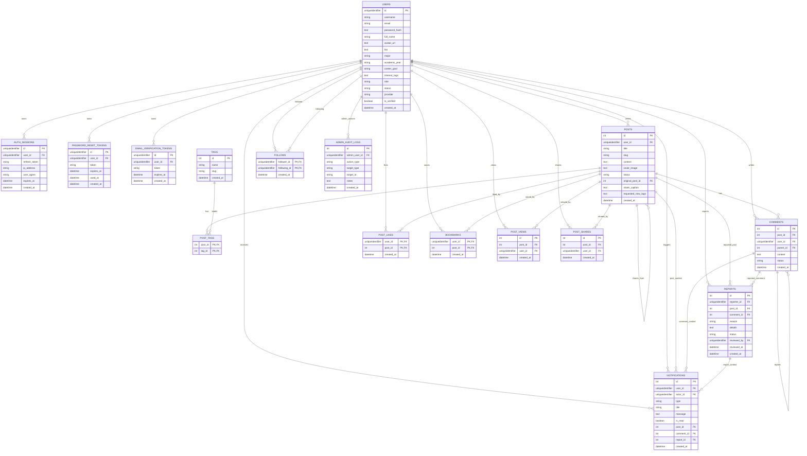

# DATABASE

Tài liệu này mô tả cơ sở dữ liệu hiện tại của hệ thống **UITConnect / SE104 Forum App** theo các SQLAlchemy model trong `backend/models`.

Hệ thống đang dùng:

- Database: Microsoft SQL Server.
- SQLAlchemy URL: `mssql+pyodbc`.
- Driver: `ODBC Driver 18 for SQL Server`.
- Khởi tạo ORM: `backend/database.py`.

> Ghi chú: tài liệu này phản ánh schema hiện tại trong source code. Một số tính năng recommendation dùng dữ liệu từ các bảng hiện có như `users.interest_tags`, `post_likes`, `comments`, `follows`, không có bảng `user_interests` riêng.

---

## 1. Danh Sách Bảng

| Nhóm | Bảng | Mục đích |
| --- | --- | --- |
| Người dùng & xác thực | `users` | Tài khoản, hồ sơ cá nhân, vai trò, trạng thái. |
| Người dùng & xác thực | `auth_sessions` | Refresh token/session đăng nhập. |
| Người dùng & xác thực | `password_reset_tokens` | Token đặt lại mật khẩu. |
| Người dùng & xác thực | `email_verification_tokens` | Token xác minh email. Hiện luồng verify email đang tạm tắt ở nghiệp vụ. |
| Nội dung | `posts` | Bài viết, bài share, trạng thái duyệt/xóa. |
| Nội dung | `tags` | Danh mục tag. |
| Nội dung | `post_tags` | Bảng nối nhiều-nhiều giữa post và tag. |
| Tương tác | `comments` | Bình luận và reply dạng cây. |
| Tương tác | `post_likes` | Like bài viết. |
| Tương tác | `bookmarks` | Lưu bài viết. |
| Tương tác | `post_views` | Lượt xem bài viết. |
| Tương tác | `post_shares` | Log lượt share bài viết. |
| Tương tác | `follows` | Quan hệ follow giữa user với user. |
| Điều phối & kiểm duyệt | `reports` | Báo cáo bài viết hoặc bình luận. |
| Điều phối & kiểm duyệt | `notifications` | Thông báo cho user/admin. |
| Điều phối & kiểm duyệt | `admin_audit_logs` | Nhật ký thao tác admin. |

---

## 2. Users & Authentication

### Bảng `users`

Lưu tài khoản, hồ sơ cá nhân, quyền và trạng thái.

| Cột | Kiểu | Ràng buộc | Mô tả |
| --- | --- | --- | --- |
| `id` | `UNIQUEIDENTIFIER` | PK, default `NEWSEQUENTIALID()` | ID user. |
| `username` | `String(50)` | Unique, nullable, index | Tên đăng nhập/public handle. |
| `email` | `String(255)` | Unique, not null, index | Email đăng nhập. |
| `password_hash` | `Text` | Not null | Hash mật khẩu local. |
| `full_name` | `Unicode(255)` | Not null | Tên hiển thị. |
| `avatar_url` | `UnicodeText` | Nullable | URL/base64 avatar. |
| `bio` | `UnicodeText` | Nullable | Giới thiệu cá nhân. |
| `major` | `Unicode(120)` | Nullable | Chuyên ngành. |
| `academic_year` | `String(30)` | Nullable | Năm học/khóa. |
| `career_goal` | `Unicode(200)` | Nullable | Mục tiêu nghề nghiệp. |
| `interest_tags` | `Text` | Nullable | Danh sách tag quan tâm, lưu dạng chuỗi phân tách bằng dấu phẩy. |
| `role` | `String(50)` | Default `Student` | Vai trò, thường là `Student` hoặc `admin`. |
| `status` | `String(50)` | Default `active` | Trạng thái tài khoản: `active`, `banned`, `deleted`. |
| `provider` | `String(50)` | Default `local` | Nguồn đăng nhập: local/google. |
| `is_verified` | `Boolean` | Default `0` | Trạng thái xác minh email. |
| `created_at` | `DateTime` | Default `func.now()` | Thời điểm tạo. |

Quan hệ chính:

- `users` 1-N `posts`
- `users` 1-N `comments`
- `users` 1-N `auth_sessions`
- `users` 1-N `notifications`
- `users` N-N `users` qua `follows`

### Bảng `auth_sessions`

Lưu refresh token cho phiên đăng nhập.

| Cột | Kiểu | Ràng buộc | Mô tả |
| --- | --- | --- | --- |
| `id` | `UNIQUEIDENTIFIER` | PK, default `NEWSEQUENTIALID()` | ID session. |
| `user_id` | `UNIQUEIDENTIFIER` | FK `users.id`, cascade delete, index | Chủ session. |
| `refresh_token` | `String(512)` | Unique, not null, index | Token dùng để refresh access token. |
| `ip_address` | `String(100)` | Nullable | IP client. |
| `user_agent` | `String(500)` | Nullable | User agent client. |
| `expires_at` | `DateTime` | Not null | Hạn session. |
| `created_at` | `DateTime` | Default `func.now()` | Ngày tạo session. |

### Bảng `password_reset_tokens`

| Cột | Kiểu | Ràng buộc | Mô tả |
| --- | --- | --- | --- |
| `id` | `UNIQUEIDENTIFIER` | PK, default `NEWSEQUENTIALID()` | ID token. |
| `user_id` | `UNIQUEIDENTIFIER` | FK `users.id`, cascade delete, index | User cần reset mật khẩu. |
| `token` | `String(255)` | Unique, not null, index | Token reset. |
| `expires_at` | `DateTime` | Not null | Hạn token. |
| `used_at` | `DateTime` | Nullable | Thời điểm đã dùng token. |
| `created_at` | `DateTime` | Default `func.now()` | Ngày tạo. |

### Bảng `email_verification_tokens`

| Cột | Kiểu | Ràng buộc | Mô tả |
| --- | --- | --- | --- |
| `id` | `UNIQUEIDENTIFIER` | PK, default `NEWSEQUENTIALID()` | ID token. |
| `user_id` | `UNIQUEIDENTIFIER` | FK `users.id`, index | User cần xác minh email. |
| `token` | `String(255)` | Unique, not null, index | Token xác minh. |
| `expires_at` | `DateTime` | Not null | Hạn token. |
| `created_at` | `DateTime` | Default `func.now()` | Ngày tạo. |

---

## 3. Posts & Tags

### Bảng `posts`

Lưu bài viết gốc và bài viết được share.

| Cột | Kiểu | Ràng buộc | Mô tả |
| --- | --- | --- | --- |
| `id` | `Integer` | PK, autoincrement | ID bài viết. |
| `user_id` | `UNIQUEIDENTIFIER` | FK `users.id`, not null, index | Tác giả bài viết. |
| `title` | `Unicode(255)` | Not null | Tiêu đề. |
| `slug` | `String(255)` | Unique, nullable | Slug từ title. Hiện chưa tự xử lý trùng slug. |
| `content` | `UnicodeText` | Not null | Nội dung bài viết. |
| `cover_image` | `Text` | Nullable | URL/base64 ảnh bìa. |
| `status` | `String(20)` | Default `pending`, index | Trạng thái: `pending`, `active`, `rejected`, `deleted`. |
| `original_post_id` | `Integer` | FK `posts.id`, nullable, index | ID bài gốc nếu đây là bài share. |
| `share_caption` | `UnicodeText` | Nullable | Caption khi share bài. |
| `requested_new_tags` | `UnicodeText` | Nullable | JSON list tag mới do user đề xuất, chờ admin duyệt. |
| `created_at` | `DateTime` | Default `func.now()` | Thời điểm tạo. |

Ghi chú nghiệp vụ:

- User thường tạo/sửa bài sẽ đưa bài về `pending`.
- Admin tạo bài thì bài có thể `active` ngay.
- Xóa bài là soft delete bằng `status = "deleted"`.
- Share bài tạo một record `posts` mới, có `original_post_id` trỏ về bài gốc.

### Bảng `tags`

| Cột | Kiểu | Ràng buộc | Mô tả |
| --- | --- | --- | --- |
| `id` | `Integer` | PK, autoincrement | ID tag. |
| `name` | `String(100)` | Unique, not null, index | Tên tag. |
| `slug` | `String(120)` | Unique, not null, index | Slug dùng để lọc. |
| `created_at` | `DateTime` | Default `func.now()` | Ngày tạo tag. |

### Bảng `post_tags`

Bảng nối nhiều-nhiều giữa `posts` và `tags`.

| Cột | Kiểu | Ràng buộc | Mô tả |
| --- | --- | --- | --- |
| `post_id` | `Integer` | PK, FK `posts.id`, cascade delete | Bài viết. |
| `tag_id` | `Integer` | PK, FK `tags.id`, cascade delete | Tag. |

---

## 4. Comments

### Bảng `comments`

Lưu bình luận và reply.

| Cột | Kiểu | Ràng buộc | Mô tả |
| --- | --- | --- | --- |
| `id` | `Integer` | PK, autoincrement | ID comment. |
| `post_id` | `Integer` | FK `posts.id`, not null, index | Bài viết chứa comment. |
| `user_id` | `UNIQUEIDENTIFIER` | FK `users.id`, not null, index | Người bình luận. |
| `parent_id` | `Integer` | FK `comments.id`, nullable | Nếu có thì đây là reply của comment cha. |
| `content` | `UnicodeText` | Not null | Nội dung comment. |
| `status` | `String(20)` | Default `active`, index | Trạng thái: `active`, `hidden`. |
| `created_at` | `DateTime` | Default `func.now()` | Thời điểm tạo. |

Ghi chú:

- Comment không cần duyệt trước, mặc định `active`.
- Admin có thể ẩn comment sau khi xử lý report bằng `status = "hidden"`.

---

## 5. Interactions

### Bảng `post_likes`

| Cột | Kiểu | Ràng buộc | Mô tả |
| --- | --- | --- | --- |
| `user_id` | `UNIQUEIDENTIFIER` | PK, FK `users.id` | User like bài. |
| `post_id` | `Integer` | PK, FK `posts.id` | Bài được like. |
| `created_at` | `DateTime` | Default `func.now()` | Thời điểm like. |

### Bảng `bookmarks`

| Cột | Kiểu | Ràng buộc | Mô tả |
| --- | --- | --- | --- |
| `user_id` | `UNIQUEIDENTIFIER` | PK, FK `users.id` | User lưu bài. |
| `post_id` | `Integer` | PK, FK `posts.id` | Bài được lưu. |
| `created_at` | `DateTime` | Default `func.now()` | Thời điểm lưu. |

### Bảng `post_views`

| Cột | Kiểu | Ràng buộc | Mô tả |
| --- | --- | --- | --- |
| `id` | `Integer` | PK, autoincrement | ID view. |
| `post_id` | `Integer` | FK `posts.id`, not null, index | Bài được xem. |
| `user_id` | `UNIQUEIDENTIFIER` | FK `users.id`, nullable, index | User xem bài, có thể null. |
| `created_at` | `DateTime` | Default `func.now()` | Thời điểm xem. |

### Bảng `post_shares`

| Cột | Kiểu | Ràng buộc | Mô tả |
| --- | --- | --- | --- |
| `id` | `Integer` | PK, autoincrement | ID share log. |
| `post_id` | `Integer` | FK `posts.id`, not null, index | Bài gốc được share. |
| `user_id` | `UNIQUEIDENTIFIER` | FK `users.id`, nullable, index | User share bài. |
| `created_at` | `DateTime` | Default `func.now()` | Thời điểm share. |

### Bảng `follows`

| Cột | Kiểu | Ràng buộc | Mô tả |
| --- | --- | --- | --- |
| `follower_id` | `UNIQUEIDENTIFIER` | PK, FK `users.id` | Người theo dõi. |
| `following_id` | `UNIQUEIDENTIFIER` | PK, FK `users.id` | Người được theo dõi. |
| `created_at` | `DateTime` | Default `func.now()` | Thời điểm follow. |

---

## 6. Reports & Moderation

### Bảng `reports`

Một bảng dùng chung cho report bài viết và comment.

| Cột | Kiểu | Ràng buộc | Mô tả |
| --- | --- | --- | --- |
| `id` | `Integer` | PK, autoincrement | ID report. |
| `reporter_id` | `UNIQUEIDENTIFIER` | FK `users.id`, nullable, index | User gửi report. |
| `post_id` | `Integer` | FK `posts.id`, nullable, index | Bài bị report. |
| `comment_id` | `Integer` | FK `comments.id`, nullable, index | Comment bị report. |
| `reason` | `String(100)` | Not null | Lý do report: spam, harassment, hate_speech, violence, misinformation, other. |
| `details` | `UnicodeText` | Nullable | Mô tả bổ sung. |
| `status` | `String(30)` | Default `pending` | Trạng thái: `pending`, `reviewed`, `dismissed`, `resolved`. |
| `reviewed_by` | `UNIQUEIDENTIFIER` | FK `users.id`, nullable | Admin xử lý. |
| `reviewed_at` | `DateTime` | Nullable | Thời điểm xử lý. |
| `created_at` | `DateTime` | Default `func.now()` | Thời điểm report. |

Ghi chú:

- Report bài: `post_id` có giá trị, `comment_id` null.
- Report comment: `comment_id` có giá trị, thường kèm `post_id`.
- Admin xử lý report trong `backend/routers/admin.py`.

### Bảng `admin_audit_logs`

Lưu log thao tác admin.

| Cột | Kiểu | Ràng buộc | Mô tả |
| --- | --- | --- | --- |
| `id` | `Integer` | PK, autoincrement | ID log. |
| `admin_user_id` | `UNIQUEIDENTIFIER` | FK `users.id`, not null, index | Admin thực hiện. |
| `action_type` | `String(50)` | Not null, index | Loại hành động: approve_post, reject_post, moderate_report, ban_user... |
| `target_type` | `String(50)` | Not null, index | Loại đối tượng: post, report, user... |
| `target_id` | `String(100)` | Not null | ID đối tượng bị tác động. |
| `notes` | `Text` | Nullable | Ghi chú chi tiết. |
| `created_at` | `DateTime` | Default `func.now()`, index | Thời điểm ghi log. |

---

## 7. Notifications

### Bảng `notifications`

Lưu thông báo dạng pull-based. Frontend lấy thông báo khi mở dropdown, không phải realtime websocket.

| Cột | Kiểu | Ràng buộc | Mô tả |
| --- | --- | --- | --- |
| `id` | `Integer` | PK, autoincrement | ID notification. |
| `user_id` | `UNIQUEIDENTIFIER` | FK `users.id`, not null, index | Người nhận thông báo. |
| `actor_id` | `UNIQUEIDENTIFIER` | FK `users.id`, nullable | Người tạo ra sự kiện. |
| `type` | `String(50)` | Not null | Loại thông báo. |
| `title` | `String(255)` | Not null | Tiêu đề thông báo. |
| `message` | `Text` | Nullable | Nội dung thông báo. |
| `is_read` | `Boolean` | Default `0` | Đã đọc hay chưa. |
| `post_id` | `Integer` | FK `posts.id`, nullable | Bài liên quan. |
| `comment_id` | `Integer` | FK `comments.id`, nullable | Comment liên quan. |
| `report_id` | `Integer` | FK `reports.id`, nullable | Report liên quan. |
| `created_at` | `DateTime` | Default `func.now()` | Thời điểm tạo. |

Một số `type` đang dùng:

- `new_post`
- `post_pending`
- `post_like`
- `post_share`
- `comment`
- `reply`
- `follow`
- `post_report`
- `post_reported`
- `comment_report`
- `comment_reported`
- `post_moderation`
- `comment_moderation`
- `post_approved`
- `post_rejected`
- `report_update`
- `account_status`

---

## 8. Mermaid ERD

```mermaid
erDiagram
    USERS {
        uniqueidentifier id PK
        string username
        string email
        text password_hash
        string full_name
        text avatar_url
        text bio
        string major
        string academic_year
        string career_goal
        text interest_tags
        string role
        string status
        string provider
        boolean is_verified
        datetime created_at
    }

    AUTH_SESSIONS {
        uniqueidentifier id PK
        uniqueidentifier user_id FK
        string refresh_token
        string ip_address
        string user_agent
        datetime expires_at
        datetime created_at
    }

    PASSWORD_RESET_TOKENS {
        uniqueidentifier id PK
        uniqueidentifier user_id FK
        string token
        datetime expires_at
        datetime used_at
        datetime created_at
    }

    EMAIL_VERIFICATION_TOKENS {
        uniqueidentifier id PK
        uniqueidentifier user_id FK
        string token
        datetime expires_at
        datetime created_at
    }

    POSTS {
        int id PK
        uniqueidentifier user_id FK
        string title
        string slug
        text content
        text cover_image
        string status
        int original_post_id FK
        text share_caption
        text requested_new_tags
        datetime created_at
    }

    TAGS {
        int id PK
        string name
        string slug
        datetime created_at
    }

    POST_TAGS {
        int post_id PK,FK
        int tag_id PK,FK
    }

    COMMENTS {
        int id PK
        int post_id FK
        uniqueidentifier user_id FK
        int parent_id FK
        text content
        string status
        datetime created_at
    }

    POST_LIKES {
        uniqueidentifier user_id PK,FK
        int post_id PK,FK
        datetime created_at
    }

    BOOKMARKS {
        uniqueidentifier user_id PK,FK
        int post_id PK,FK
        datetime created_at
    }

    POST_VIEWS {
        int id PK
        int post_id FK
        uniqueidentifier user_id FK
        datetime created_at
    }

    POST_SHARES {
        int id PK
        int post_id FK
        uniqueidentifier user_id FK
        datetime created_at
    }

    FOLLOWS {
        uniqueidentifier follower_id PK,FK
        uniqueidentifier following_id PK,FK
        datetime created_at
    }

    REPORTS {
        int id PK
        uniqueidentifier reporter_id FK
        int post_id FK
        int comment_id FK
        string reason
        text details
        string status
        uniqueidentifier reviewed_by FK
        datetime reviewed_at
        datetime created_at
    }

    NOTIFICATIONS {
        int id PK
        uniqueidentifier user_id FK
        uniqueidentifier actor_id FK
        string type
        string title
        text message
        boolean is_read
        int post_id FK
        int comment_id FK
        int report_id FK
        datetime created_at
    }

    ADMIN_AUDIT_LOGS {
        int id PK
        uniqueidentifier admin_user_id FK
        string action_type
        string target_type
        string target_id
        text notes
        datetime created_at
    }

    USERS ||--o{ AUTH_SESSIONS : owns
    USERS ||--o{ PASSWORD_RESET_TOKENS : owns
    USERS ||--o{ EMAIL_VERIFICATION_TOKENS : owns

    USERS ||--o{ POSTS : writes
    POSTS ||--o{ POSTS : shares_from
    USERS ||--o{ COMMENTS : writes
    POSTS ||--o{ COMMENTS : has
    COMMENTS ||--o{ COMMENTS : replies

    POSTS ||--o{ POST_TAGS : has
    TAGS ||--o{ POST_TAGS : labels

    USERS ||--o{ POST_LIKES : likes
    POSTS ||--o{ POST_LIKES : liked_by
    USERS ||--o{ BOOKMARKS : saves
    POSTS ||--o{ BOOKMARKS : saved_by
    USERS ||--o{ POST_VIEWS : views
    POSTS ||--o{ POST_VIEWS : viewed_by
    USERS ||--o{ POST_SHARES : shares
    POSTS ||--o{ POST_SHARES : shared_by

    USERS ||--o{ FOLLOWS : follower
    USERS ||--o{ FOLLOWS : following

    USERS ||--o{ REPORTS : reports
    POSTS ||--o{ REPORTS : reported_post
    COMMENTS ||--o{ REPORTS : reported_comment

    USERS ||--o{ NOTIFICATIONS : receives
    USERS ||--o{ NOTIFICATIONS : triggers
    POSTS ||--o{ NOTIFICATIONS : post_context
    COMMENTS ||--o{ NOTIFICATIONS : comment_context
    REPORTS ||--o{ NOTIFICATIONS : report_context

    USERS ||--o{ ADMIN_AUDIT_LOGS : admin_actions
```

---

## 9. Khác Biệt So Với Bản Thiết Kế Cũ

- Không có bảng `interactions`; hệ thống tách thành `post_likes`, `bookmarks`, `post_views`, `post_shares`, `follows`.
- Không có bảng `likes`; tên bảng thực tế là `post_likes`.
- Không có bảng `user_interests`; interest tag đang lưu trong `users.interest_tags`.
- Không có `post_reports` và `comment_reports` riêng; hệ thống dùng chung bảng `reports`.
- `posts` không lưu `view_count` hoặc `trending_score` trực tiếp; các chỉ số này được tính từ `post_views`, `post_likes`, `comments`, `post_shares`.
- `notifications` dùng cột `user_id` và `actor_id`, không dùng `receiver_id` và `sender_id`.
- `comments` có `status` để ẩn comment sau kiểm duyệt.
- `posts` có `status = deleted` để soft delete.

