# Thiết kế Use Case — Student Forum System

## 1. Danh sách Actor

| Actor | Loại | Mô tả |
|---|---|---|
| **Khách (Guest)** | Primary | Người truy cập chưa đăng nhập. Chỉ có thể xem landing page, đăng ký và đăng nhập |
| **Sinh viên (Student)** | Primary | Người dùng đã đăng nhập. Có thể đăng bài, tương tác, quản lý hồ sơ |
| **Quản trị viên (Admin)** | Primary | Người dùng có quyền quản trị. Quản lý người dùng, kiểm duyệt nội dung, quản lý hệ thống |

> [!NOTE]
> **Hệ thống AI** (actor phụ) sẽ được bổ sung trong giai đoạn mở rộng nếu có thời gian. Các use case AI đã được đánh dấu ở cuối tài liệu.

---

## 2. Sơ đồ Use Case

```mermaid
graph TB
    %% Actors
    Guest["👤 Khách"]
    Student["👤 Sinh viên"]
    Admin["👤 Quản trị viên"]

    subgraph system["🖥️ Student Forum System"]
        direction TB

        subgraph auth["Xác thực"]
            UC01["UC-01: Đăng ký tài khoản"]
            UC02["UC-02: Đăng nhập"]
            UC03["UC-03: Đăng xuất"]
            UC04["UC-04: Đăng nhập OAuth"]
        end

        subgraph posts["Quản lý bài viết"]
            UC05["UC-05: Tạo bài viết"]
            UC06["UC-06: Chỉnh sửa bài viết"]
            UC07["UC-07: Xóa bài viết"]
            UC08["UC-08: Xem chi tiết bài viết"]
        end

        subgraph feed["Feed & Tìm kiếm"]
            UC09["UC-09: Xem bảng tin"]
            UC10["UC-10: Tìm kiếm bài viết"]
            UC11["UC-11: Lọc bài viết theo tag"]
            UC12["UC-12: Sắp xếp bài viết"]
        end

        subgraph interact["Tương tác"]
            UC13["UC-13: Like bài viết"]
            UC14["UC-14: Bookmark bài viết"]
            UC15["UC-15: Chia sẻ bài viết"]
            UC16["UC-16: Bình luận bài viết"]
            UC17["UC-17: Trả lời bình luận"]
            UC18["UC-18: Báo cáo nội dung"]
        end

        subgraph profile["Hồ sơ & Xã hội"]
            UC19["UC-19: Xem hồ sơ người dùng"]
            UC20["UC-20: Chỉnh sửa hồ sơ"]
            UC21["UC-21: Follow / Unfollow"]
        end

        subgraph admin_group["Quản trị"]
            UC22["UC-22: Quản lý người dùng"]
            UC23["UC-23: Kiểm duyệt nội dung"]
            UC24["UC-24: Quản lý tags"]
            UC25["UC-25: Xem thông báo"]
        end
    end

    %% Guest connections
    Guest --> UC01
    Guest --> UC02
    Guest --> UC04

    %% Student connections
    Student --> UC03
    Student --> UC05
    Student --> UC06
    Student --> UC07
    Student --> UC08
    Student --> UC09
    Student --> UC10
    Student --> UC11
    Student --> UC12
    Student --> UC13
    Student --> UC14
    Student --> UC15
    Student --> UC16
    Student --> UC17
    Student --> UC18
    Student --> UC19
    Student --> UC20
    Student --> UC21
    Student --> UC25

    %% Admin connections
    Admin --> UC22
    Admin --> UC23
    Admin --> UC24
    Admin --> UC25
```

---

## 3. Quan hệ giữa các Use Case

| Loại | Use Case gốc | Use Case liên quan | Giải thích |
|---|---|---|---|
| `«include»` | UC-05: Tạo bài viết | UC-02: Đăng nhập | Phải đăng nhập mới tạo được bài |
| `«include»` | UC-06: Chỉnh sửa bài viết | UC-08: Xem chi tiết | Phải xem bài trước khi sửa |
| `«include»` | UC-17: Trả lời bình luận | UC-16: Bình luận | Trả lời là một dạng bình luận |
| `«extend»` | UC-09: Xem bảng tin | UC-10: Tìm kiếm | Tìm kiếm là tùy chọn khi xem feed |
| `«extend»` | UC-09: Xem bảng tin | UC-11: Lọc theo tag | Lọc tag là tùy chọn khi xem feed |
| `«extend»` | UC-09: Xem bảng tin | UC-12: Sắp xếp | Sắp xếp là tùy chọn khi xem feed |
| `«extend»` | UC-05: Tạo bài viết | Upload ảnh bìa | Ảnh bìa không bắt buộc |
| `«extend»` | UC-08: Xem chi tiết | UC-18: Báo cáo nội dung | Báo cáo là tùy chọn khi xem bài |
| Generalization | UC-04: Đăng nhập OAuth | UC-02: Đăng nhập | OAuth là dạng đặc biệt của Đăng nhập |

---

## 4. Mô tả chi tiết từng Use Case

---

### UC-01: Đăng ký tài khoản

| Mục | Nội dung |
|---|---|
| **Actor** | Khách |
| **Mô tả** | Khách tạo tài khoản mới để tham gia diễn đàn |
| **Điều kiện trước** | Khách chưa có tài khoản, đang ở trang Đăng ký |
| **Điều kiện sau** | Tài khoản được tạo trong hệ thống, chuyển về trang Đăng nhập |
| **Luồng chính** | 1. Khách nhập username, email, password, xác nhận password → 2. Hệ thống validate dữ liệu → 3. Hệ thống tạo tài khoản → 4. Hiển thị thông báo thành công → 5. Chuyển hướng về trang Đăng nhập |
| **Luồng thay thế** | 3a. Email đã tồn tại → hiển thị lỗi. 3b. Password < 6 ký tự → hiển thị lỗi. 3c. Password không khớp → hiển thị lỗi |

---

### UC-02: Đăng nhập

| Mục | Nội dung |
|---|---|
| **Actor** | Khách |
| **Mô tả** | Khách xác thực để truy cập hệ thống |
| **Điều kiện trước** | Khách đã có tài khoản |
| **Điều kiện sau** | Sinh viên được cấp JWT token, chuyển đến Feed |
| **Luồng chính** | 1. Khách nhập email và password → 2. Hệ thống xác thực thông tin → 3. Cấp JWT token, lưu session → 4. Chuyển hướng đến trang Feed |
| **Luồng thay thế** | 2a. Email không tồn tại → hiển thị lỗi. 2b. Password sai → hiển thị lỗi. 2c. Tài khoản bị khóa → hiển thị thông báo |

---

### UC-03: Đăng xuất

| Mục | Nội dung |
|---|---|
| **Actor** | Sinh viên |
| **Mô tả** | Sinh viên kết thúc phiên đăng nhập |
| **Điều kiện trước** | Sinh viên đang đăng nhập |
| **Điều kiện sau** | Token bị xóa, chuyển về trang Đăng nhập |
| **Luồng chính** | 1. Sinh viên bấm Logout → 2. Hệ thống xóa token/session → 3. Chuyển hướng về trang Landing hoặc Login |

---

### UC-04: Đăng nhập bằng OAuth

| Mục | Nội dung |
|---|---|
| **Actor** | Khách |
| **Mô tả** | Khách đăng nhập nhanh qua Google hoặc GitHub |
| **Điều kiện trước** | Khách có tài khoản Google/GitHub |
| **Điều kiện sau** | Tài khoản được tạo/liên kết, đăng nhập thành công |
| **Luồng chính** | 1. Khách chọn "Login with Google/GitHub" → 2. Chuyển hướng đến OAuth provider → 3. Khách xác thực → 4. Hệ thống nhận thông tin, tạo/liên kết tài khoản → 5. Cấp JWT, chuyển đến Feed |

---

### UC-05: Tạo bài viết

| Mục | Nội dung |
|---|---|
| **Actor** | Sinh viên |
| **Mô tả** | Sinh viên đăng bài viết mới lên diễn đàn |
| **Điều kiện trước** | Sinh viên đã đăng nhập |
| **Điều kiện sau** | Bài viết xuất hiện trên Feed |
| **Luồng chính** | 1. Sinh viên bấm "New Post" → 2. Nhập tiêu đề, nội dung → 3. (Tùy chọn) Upload ảnh bìa → 4. (Tùy chọn) Thêm tags → 5. Xem preview → 6. Bấm "Publish" → 7. Hệ thống lưu bài, chuyển đến trang chi tiết bài |
| **Luồng thay thế** | 6a. Tiêu đề hoặc nội dung trống → nút Publish bị vô hiệu hóa |

---

### UC-06: Chỉnh sửa bài viết

| Mục | Nội dung |
|---|---|
| **Actor** | Sinh viên |
| **Mô tả** | Sinh viên sửa bài viết do mình tạo |
| **Điều kiện trước** | Sinh viên đã đăng nhập, bài viết thuộc về sinh viên này |
| **Điều kiện sau** | Bài viết được cập nhật |
| **Luồng chính** | 1. Sinh viên xem chi tiết bài → 2. Bấm "Edit post" → 3. Sửa tiêu đề/nội dung/ảnh/tags → 4. Bấm "Save changes" → 5. Hệ thống cập nhật, quay về trang chi tiết |
| **Luồng thay thế** | 2a. Bài viết không phải của mình → hiển thị "You can only edit your own posts" |

---

### UC-07: Xóa bài viết

| Mục | Nội dung |
|---|---|
| **Actor** | Sinh viên, Admin |
| **Mô tả** | Xóa một bài viết khỏi hệ thống |
| **Điều kiện trước** | SV: bài viết thuộc về mình. Admin: bất kỳ bài nào |
| **Điều kiện sau** | Bài viết và các comment liên quan bị xóa |
| **Luồng chính** | 1. Bấm "Delete post" → 2. Hệ thống hiện hộp thoại xác nhận → 3. Bấm xác nhận → 4. Xóa bài + comments → 5. Chuyển về Feed |
| **Luồng thay thế** | 3a. Bấm Cancel → đóng hộp thoại, không xóa |

---

### UC-08: Xem chi tiết bài viết

| Mục | Nội dung |
|---|---|
| **Actor** | Sinh viên |
| **Mô tả** | Xem nội dung đầy đủ của một bài viết |
| **Điều kiện trước** | Sinh viên đã đăng nhập, bài viết tồn tại |
| **Điều kiện sau** | Lượt xem (views) tăng 1 |
| **Luồng chính** | 1. Bấm vào bài viết trên Feed → 2. Hệ thống hiển thị: nội dung đầy đủ, thông tin tác giả, tags, ảnh bìa, lượt tương tác, phần comment, bài viết liên quan |
| **Luồng thay thế** | 2a. Bài viết không tồn tại → hiển thị "Post not found" + link quay về Feed |

---

### UC-09: Xem bảng tin (Feed)

| Mục | Nội dung |
|---|---|
| **Actor** | Sinh viên |
| **Mô tả** | Xem danh sách bài viết trên bảng tin chính |
| **Điều kiện trước** | Sinh viên đã đăng nhập |
| **Điều kiện sau** | Danh sách bài viết được hiển thị |
| **Luồng chính** | 1. Sinh viên truy cập /feed → 2. Hệ thống hiển thị bài viết theo tab mặc định "For You" → 3. Sinh viên cuộn xuống → 4. Hệ thống tự động tải thêm bài viết (infinite scroll) |
| **Luồng thay thế** | 2a. Chuyển tab "Following" → chỉ hiện bài từ người đang follow. 2b. Chuyển tab "Trending" → chỉ hiện bài có trending score cao |

---

### UC-10: Tìm kiếm bài viết

| Mục | Nội dung |
|---|---|
| **Actor** | Sinh viên |
| **Mô tả** | Tìm bài viết theo từ khóa |
| **Điều kiện trước** | Sinh viên đang ở trang Feed |
| **Điều kiện sau** | Hiển thị kết quả tìm kiếm |
| **Luồng chính** | 1. Nhập từ khóa vào thanh tìm kiếm → 2. Hệ thống debounce 350ms → 3. Lọc bài theo tiêu đề và tags → 4. Hiển thị kết quả + thông báo "Search results for ..." |
| **Luồng thay thế** | 4a. Không có kết quả → hiển thị "No posts found" |

---

### UC-11: Lọc bài viết theo tag

| Mục | Nội dung |
|---|---|
| **Actor** | Sinh viên |
| **Mô tả** | Thu hẹp feed bằng cách chọn một tag cụ thể |
| **Điều kiện trước** | Sinh viên đang ở trang Feed |
| **Điều kiện sau** | Feed chỉ hiển thị bài có tag được chọn |
| **Luồng chính** | 1. Bấm chọn tag trong bộ lọc → 2. Feed cập nhật chỉ hiện bài chứa tag đó → 3. (Tùy chọn) Bấm "Clear filter" để bỏ lọc |

---

### UC-12: Sắp xếp bài viết

| Mục | Nội dung |
|---|---|
| **Actor** | Sinh viên |
| **Mô tả** | Thay đổi thứ tự hiển thị bài viết |
| **Điều kiện trước** | Sinh viên đang ở trang Feed |
| **Điều kiện sau** | Feed sắp xếp lại theo tiêu chí |
| **Luồng chính** | 1. Chọn tiêu chí từ dropdown: Latest / Trending / Most Liked / Most Commented → 2. Feed cập nhật thứ tự |

---

### UC-13: Like / Bỏ like bài viết

| Mục | Nội dung |
|---|---|
| **Actor** | Sinh viên |
| **Mô tả** | Bày tỏ sự thích đối với bài viết |
| **Điều kiện trước** | Sinh viên đã đăng nhập |
| **Điều kiện sau** | Số like cập nhật, trending score thay đổi |
| **Luồng chính** | 1. Bấm nút Like → 2. Hệ thống tăng like +1, trending score +4 → 3. Hiển thị toast "Post liked" |
| **Luồng thay thế** | 1a. Đã like rồi → bấm lại để bỏ like, like -1, trending -2, toast "Post like removed" |

---

### UC-14: Bookmark bài viết

| Mục | Nội dung |
|---|---|
| **Actor** | Sinh viên |
| **Mô tả** | Lưu bài viết vào danh sách cá nhân để đọc sau |
| **Điều kiện trước** | Sinh viên đã đăng nhập |
| **Điều kiện sau** | Bài viết xuất hiện trong tab Bookmarks của hồ sơ |
| **Luồng chính** | 1. Bấm nút Save → 2. Hệ thống thêm vào bookmarks → 3. Toast "Saved to bookmarks" |
| **Luồng thay thế** | 1a. Đã bookmark → bấm lại để bỏ, toast "Removed from bookmarks" |

---

### UC-15: Chia sẻ bài viết

| Mục | Nội dung |
|---|---|
| **Actor** | Sinh viên |
| **Mô tả** | Copy link bài viết để chia sẻ bên ngoài |
| **Điều kiện trước** | Sinh viên đang xem bài viết |
| **Điều kiện sau** | Link bài viết được copy vào clipboard |
| **Luồng chính** | 1. Bấm Share → 2. Hệ thống copy URL vào clipboard → 3. Toast "Share link copied" |

---

### UC-16: Bình luận bài viết

| Mục | Nội dung |
|---|---|
| **Actor** | Sinh viên |
| **Mô tả** | Viết bình luận trên bài viết |
| **Điều kiện trước** | Sinh viên đã đăng nhập, đang xem chi tiết bài |
| **Điều kiện sau** | Comment xuất hiện, số comment của bài +1, trending score +3 |
| **Luồng chính** | 1. Nhập nội dung comment → 2. Bấm "Post" → 3. Hệ thống lưu comment → 4. Comment hiện lên, toast "Comment posted" |
| **Luồng thay thế** | 2a. Nội dung trống → không gửi |

---

### UC-17: Trả lời bình luận

| Mục | Nội dung |
|---|---|
| **Actor** | Sinh viên |
| **Mô tả** | Reply lên một bình luận có sẵn (nested comment) |
| **Điều kiện trước** | Đang xem chi tiết bài có bình luận |
| **Điều kiện sau** | Reply hiện bên dưới comment gốc (indented) |
| **Luồng chính** | 1. Bấm "Reply" trên comment → 2. Ô nhập reply xuất hiện → 3. Nhập nội dung → 4. Bấm "Reply" → 5. Reply hiện lên, toast "Reply posted" |
| **Luồng thay thế** | 4a. Bấm "Cancel" → đóng ô nhập, không gửi |

---

### UC-18: Báo cáo nội dung

| Mục | Nội dung |
|---|---|
| **Actor** | Sinh viên |
| **Mô tả** | Báo cáo bài viết hoặc bình luận vi phạm cho Admin |
| **Điều kiện trước** | Sinh viên đang xem bài viết/bình luận |
| **Điều kiện sau** | Báo cáo được gửi, Admin nhận thông báo |
| **Luồng chính** | 1. Bấm nút Report → 2. Chọn lý do (spam, nội dung không phù hợp, quấy rối...) → 3. (Tùy chọn) Nhập mô tả thêm → 4. Gửi báo cáo → 5. Toast "Report submitted" |

---

### UC-19: Xem hồ sơ người dùng

| Mục | Nội dung |
|---|---|
| **Actor** | Sinh viên |
| **Mô tả** | Xem thông tin và hoạt động của một user |
| **Điều kiện trước** | Sinh viên đã đăng nhập |
| **Điều kiện sau** | Trang hồ sơ hiển thị |
| **Luồng chính** | 1. Bấm vào tên/avatar user → 2. Hệ thống hiển thị: avatar, tên, username, bio, role, số followers/following, stats → 3. Xem 4 tab: Posts / Comments / Bookmarks / Likes |
| **Luồng thay thế** | 2a. User không tồn tại → hiển thị "Profile not found" |

---

### UC-20: Chỉnh sửa hồ sơ

| Mục | Nội dung |
|---|---|
| **Actor** | Sinh viên |
| **Mô tả** | Cập nhật thông tin cá nhân |
| **Điều kiện trước** | Sinh viên đang xem hồ sơ của chính mình |
| **Điều kiện sau** | Thông tin hồ sơ được cập nhật |
| **Luồng chính** | 1. Bấm "Edit profile" → 2. Sửa avatar, tên, bio → 3. Bấm Save → 4. Hệ thống cập nhật |

---

### UC-21: Follow / Unfollow người dùng

| Mục | Nội dung |
|---|---|
| **Actor** | Sinh viên |
| **Mô tả** | Theo dõi hoặc bỏ theo dõi user khác |
| **Điều kiện trước** | Sinh viên đang xem hồ sơ user khác (không phải mình) |
| **Điều kiện sau** | Danh sách following/followers cập nhật |
| **Luồng chính** | 1. Bấm "Follow" → 2. Hệ thống cập nhật: following +1 cho mình, followers +1 cho người kia → 3. Toast "Following [tên]" |
| **Luồng thay thế** | 1a. Đã follow → bấm "Following" để unfollow, toast "Unfollowed [tên]" |

---

### UC-22: Quản lý người dùng

| Mục | Nội dung |
|---|---|
| **Actor** | Admin |
| **Mô tả** | Xem danh sách, khóa/mở khóa, xóa tài khoản người dùng |
| **Điều kiện trước** | Admin đã đăng nhập |
| **Điều kiện sau** | Trạng thái tài khoản được cập nhật |
| **Luồng chính** | 1. Admin truy cập trang quản lý user → 2. Xem danh sách user (tên, email, role, trạng thái) → 3. Chọn khóa/mở khóa/xóa user → 4. Hệ thống cập nhật |

---

### UC-23: Kiểm duyệt nội dung

| Mục | Nội dung |
|---|---|
| **Actor** | Admin |
| **Mô tả** | Xét duyệt bài viết/bình luận bị báo cáo |
| **Điều kiện trước** | Có nội dung bị báo cáo (từ UC-18) |
| **Điều kiện sau** | Nội dung được giữ lại hoặc bị ẩn/xóa |
| **Luồng chính** | 1. Admin xem danh sách báo cáo → 2. Xem nội dung bị báo cáo → 3. Quyết định: giữ lại / ẩn / xóa → 4. Hệ thống cập nhật, thông báo cho người đăng |

---

### UC-24: Quản lý tags

| Mục | Nội dung |
|---|---|
| **Actor** | Admin |
| **Mô tả** | Thêm, sửa, xóa tags hệ thống |
| **Điều kiện trước** | Admin đã đăng nhập |
| **Điều kiện sau** | Danh sách tags cập nhật |
| **Luồng chính** | 1. Admin truy cập trang quản lý tags → 2. Thêm tag mới / sửa tên tag / xóa tag → 3. Hệ thống cập nhật |

---

### UC-25: Xem thông báo

| Mục | Nội dung |
|---|---|
| **Actor** | Sinh viên, Admin |
| **Mô tả** | Xem các thông báo liên quan đến hoạt động |
| **Điều kiện trước** | Đã đăng nhập |
| **Điều kiện sau** | Thông báo được đánh dấu đã đọc |
| **Luồng chính** | 1. Bấm icon chuông → 2. Hệ thống hiển thị danh sách thông báo (comment mới, like, follow, bài bị kiểm duyệt...) → 3. Bấm vào thông báo → chuyển đến nội dung liên quan |
| **Thông báo cho SV** | Có người like/comment bài mình, có người follow, bài bị kiểm duyệt |
| **Thông báo cho Admin** | Có báo cáo mới, user mới đăng ký |

---

## 5. Tóm tắt thống kê

| Nhóm | Số UC | Danh sách |
|---|---|---|
| Xác thực | 4 | UC-01 → UC-04 |
| Quản lý bài viết | 4 | UC-05 → UC-08 |
| Feed & Tìm kiếm | 4 | UC-09 → UC-12 |
| Tương tác | 6 | UC-13 → UC-18 |
| Hồ sơ & Xã hội | 3 | UC-19 → UC-21 |
| Quản trị | 4 | UC-22 → UC-25 |
| **Tổng** | **25** | |

---

## 6. Mở rộng (AI — Nếu có thời gian)

| # | Use Case | Actor | Mô tả |
|---|---|---|---|
| UC-26 | Gợi ý nội dung | Hệ thống AI | Đề xuất bài viết dựa trên lịch sử đọc/like |
| UC-27 | Kiểm duyệt tự động | Hệ thống AI | Phát hiện spam/toxic khi đăng bài hoặc comment |
| UC-28 | Cá nhân hóa Feed | Hệ thống AI | Xếp hạng feed riêng cho từng user |
